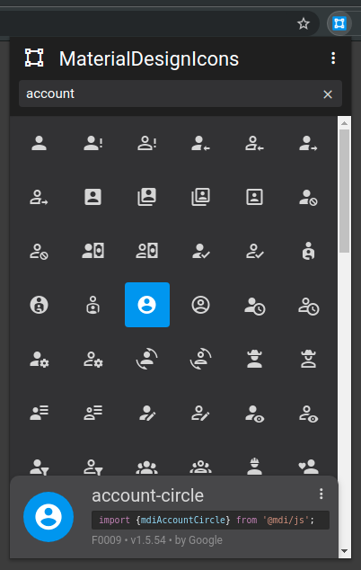
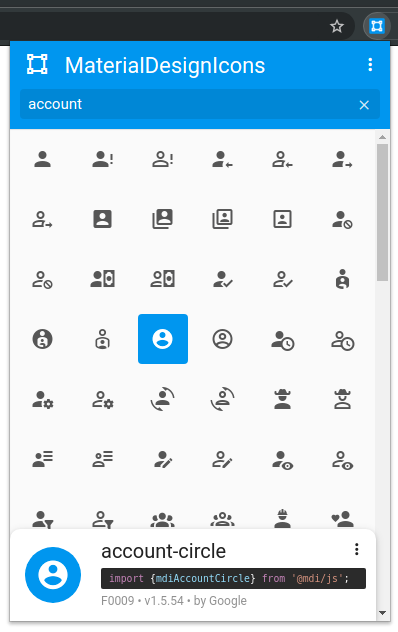

# MaterialDesignIcons-Picker
*A cute [MaterialDesignIcons](https://materialdesignicons.com) icon picker for your web browser*

[](https://chrome.google.com/webstore/detail/materialdesignicons-picke/edjaedpifkihpjkcgknfokmibkoafhme)
[](https://addons.mozilla.org/en-US/firefox/addon/materialdesignicons-picker/)

|  |  |
|:---:|:---:|

## Development

```bash
# Install dependencies
yarn install

# Run
yarn serve
# Once started, open your browser on `http://127.0.0.1:8080`!

# Compiles and minifies for production
yarn build

# Lints and fixes files
yarn lint
```

## Release

1. Check latest published version [from npm registry](https://www.npmjs.com/package/@mdi/font)
2. Update version in [package.json](./package.json): `materialdesignicons-picker.version.default`
3. Pull the icons:
    ```bash
    node tools/pull-icons.js
    ```
4. Tag a release & pack a new version:
    ```bash
    node tools/prepare-release.js
    ```

Your generated artifacts are ready in the `release/` subdirectory.
